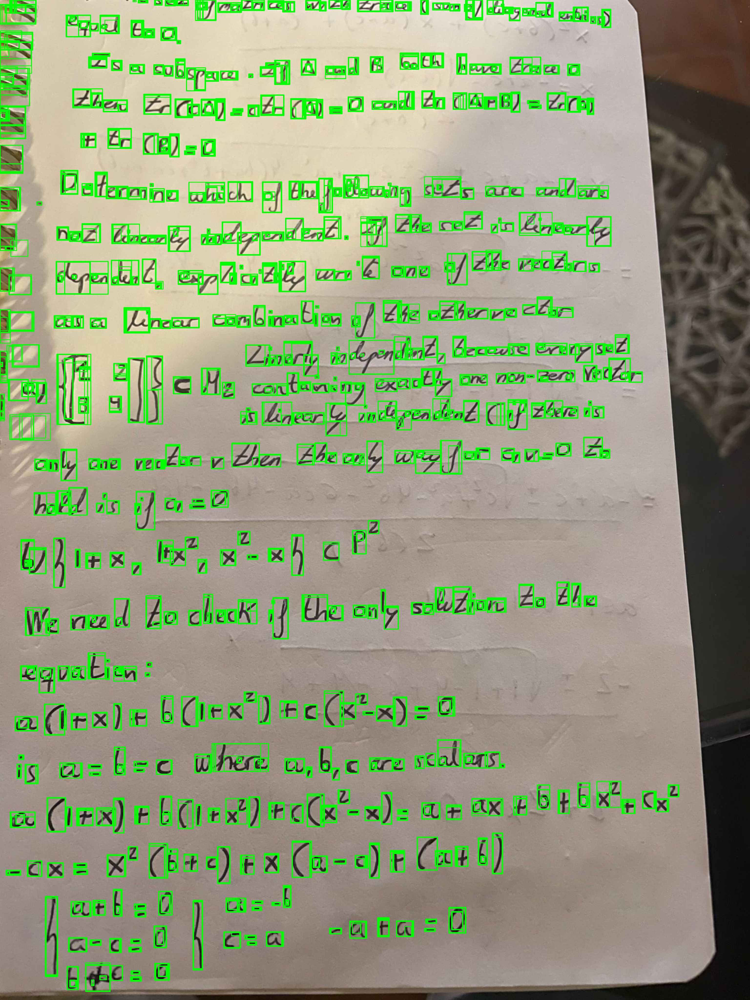

# Introduction
Improve handwriting using GANS
## Experiments

### Experiment 1

My first experiment consists on improving my "a" handwriting. The first step is to teach generator to create my "a" and then improving it with a better style. In the following gif we can see how the generator learns (upper graph) based on "a" reference used by discriminator (lower graph). A metaphor for how AI and humans can go hand in hand.

### Experiment 2

Second experiment consists on a Deep Convolutional GAN (DCGAN). Main features:

• Replace any pooling layers with strided convolutions (discriminator) and fractional-strided
convolutions (generator).<br>
• Use BatchNorm in both the generator and the discriminator.<br>
• Remove fully connected hidden layers for deeper architectures.<br>
• Use ReLU activation in generator for all layers except for the output, which uses Tanh.<br>
• Use LeakyReLU activation in the discriminator for all layers.<br>

DCGAN uses convolutions which do not depend on the number of pixels on an image. However, the number of channels is important to determine the size of the filters.

We can see a checkerboard when the image passes from poor handwriting to the pretty style one. We could not initialize the discriminator to avoid this.

### Experiment 3

Same GANS model without creating a new Discriminator instance when we change the style. We continue to see a very abrupt jump.

### Experiment 4

We go back to GANS of experiment 1. However, in this case, we have a vanishing gradient issue. When we change the image, The discriminator is unable to distinguish that change and is fooled by the generator. To avoid this, we can apply Wasserstein GAN with Gradient Penalty.

 

### Experiment 5

Build a Wasserstein GAN with Gradient Penalty (WGAN-GP) (https://arxiv.org/abs/1701.07875, https://arxiv.org/pdf/1704.00028.pdf, https://lilianweng.github.io/posts/2017-08-20-gan/) that solves the vanishing gradient issue with the GANs seen in experiment 4.


We can see as the discriminator is able to reduce the losses when picture is changing, providing feedback to generator to adapt the new style. However, we continue to see a lot of noise which could be removed adding to the generator a denoising autoencoder module https://plainenglish.io/blog/denoising-autoencoder-in-pytorch-on-mnist-dataset-a76b8824e57e. We need to analyze why in step 490 the loss discriminator increase and then is constant.

| Experiment | Description | Results | 
| -------- | -------- | -------- |
|  1   | GANS with two discriminators |    |
|  2   | GANS with convolution and two discriminators |   |
|  3   | GANS with convolution and one discriminator |   |
|  4   | GANS with one discriminator |   |
|  5   | GANS with WGAN-GP |   |


### Experiment 6

Include Autoencoder Denosing.


We can observe a high noise removal performance within a few epochs of training. However, the letters 'c' and 'e' are very similar. This might be due to the limited variability of the sample, as only one sample per character is available.

### Experiment 7

We research about object detection. We discover an important part before detection: region proposals. **Region proposal** is a technique that helps in identifying islands of regions where the pixels are similar to one another. *SelectSearch* is a region proposal algorithm used for object localization where it generates proposals of regions that are likely to be grouped together based on their pixel intensitites. However, our case is simpler and we can apply the following technique:

https://stackoverflow.com/questions/40443988/python-opencv-ocr-image-segmentation




We can see a high level character recognition but we still seeing areas with multiple characters. Therefore, Object Detection with RNN is needed. 

## Project Structure

The main project folder contains the following files and folders:

```bash
pycache__
├── call_ai_grapher
│   ├── __pycache__
│   └── notebook
├── config
├── denoise
│   └── experiment_6
├── documents
│   └── experiment_7
├── fakes
│   ├── experiment_1
│   ├── experiment_2
│   ├── experiment_3
│   ├── experiment_4
│   └── experiment_5
├── fonts
│   ├── ariana-violeta-font
│   ├── believe-it-font
│   ├── glorious-free-font
│   └── winter-song-font
├── fonts_samples
│   ├── scrivener_words_ArianaVioleta-dz2K
│   │   └── images
│   ├── scrivener_words_BelieveIt-DvLE
│   │   └── images
│   └── scrivener_words_GloriousFree-dBR6
│       └── images
├── gif
├── handwriting
│   └── images
├── myhandw
│   └── images
└── runs
    ├── Jan02_10-51-48_MCCA-DCG46M0G6N-exp_4_2024-01-02_10-51-48
    ├── Jan02_11-00-46_MCCA-DCG46M0G6N-exp_4_2024-01-02_11-00-46
    ├── Jan02_11-02-49_MCCA-DCG46M0G6N-exp_4_2024-01-02_11-02-49
    ├── Jan02_11-10-56_MCCA-DCG46M0G6N-exp_4_2024-01-02_11-10-56
    ├── Jan02_11-12-18_MCCA-DCG46M0G6N-exp_4_2024-01-02_11-12-18
    ├── Jan02_11-19-26_MCCA-DCG46M0G6N-exp_4_2024-01-02_11-19-26
    ├── Jan02_11-19-45_MCCA-DCG46M0G6N-exp_4_2024-01-02_11-19-45
    │   └── LOSS
    │       ├── mean_discriminator_loss
    │       └── mean_generator_loss
    ├── Jan02_11-21-34_MCCA-DCG46M0G6N-exp_4_2024-01-02_11-21-34
    │   └── LOSS
    │       ├── mean_discriminator_loss
    │       └── mean_generator_loss
    ├── Jan02_12-39-09_MCCA-DCG46M0G6N-exp_5_2024-01-02_12-39-09
    ├── Jan02_12-40-28_MCCA-DCG46M0G6N-exp_5_2024-01-02_12-40-28
    │   └── LOSS
    │       ├── mean_discriminator_loss
    │       └── mean_generator_loss
    ├── Jan04_18-30-27_MCCA-DCG46M0G6N-exp_6_2024-01-04_18-30-27
    │   └── LOSS
    │       ├── train_loss
    │       └── val_loss
    ├── Jan05_16-45-38_MCCA-DCG46M0G6N-exp_5_2024-01-05_16-45-38
    │   └── LOSS
    │       ├── mean_discriminator_loss
    │       └── mean_generator_loss
    ├── Jan05_16-57-47_MCCA-DCG46M0G6N-exp_5_2024-01-05_16-57-47
    │   └── LOSS
    │       ├── mean_discriminator_loss
    │       └── mean_generator_loss
    └── Jan05_17-02-25_MCCA-DCG46M0G6N-exp_5_2024-01-05_17-02-25
```
## Installation process

Install all the dependencies. Also creates the virtual environment if it didn't exist yet.
```
poetry install
```

_If the installation fails you are probably missing the required Python version. Find the required version by running `pyenv version`, and then install it by running `pyenv install x.y.z`, where x.y.z should be replaced with the version number. Depending on your internet connection and your machine the installation can take a few minutes._

Install the pre-commit hooks.
```
poetry run pre-commit install
```
## Run Gans Training

```
poetry run python -m train
```

## Run Autoencoder Denoising

```
poetry run python -m denoise
```

## Run Jupyter (FYI)

```
poetry run jupyter notebook
```
## Software dependencies
- Install [Poetry](https://python-poetry.org/docs/#installation).
## Resources
- [Poetry - Basic usage](https://python-poetry.org/docs/basic-usage/)
- [pyenv - Usage](https://github.com/pyenv/pyenv#usage)
- [Annotation Tool](https://github.com/drainingsun/ybat)

# Build and Test

Please activate the virtual environment by using `poetry shell` before running the commands below, or prefix all commands with `poetry run`.

- Run pre-commit hooks for all files (not only staged files) manually.
  ```
  pre-commit run --all-files
  ```
- Run all unit tests.
  ```
  pytest
  ```
- Measure code coverage.
  ```
  coverage run -m pytest
  ```
- Visualize code coverage.

  - View code coverage summary in terminal.
    ```
    coverage report
    ```
  - Generate HTML code coverage report.
    ```
    coverage html
    ```
  - View code coverage directly inside your code.
    ```
    coverage xml
    ```
    _Install the Coverage Gutters extension if you are using Visual Studio Code, and click on "Watch" on the left side of the status bar in the bottom of the IDE to visualize the code coverage._

# Contribute

Read [here](./CONTRIBUTING.md) how you can contribute to make our code better.


https://github.com/clovaai/CRAFT-pytorch?tab=readme-ov-file