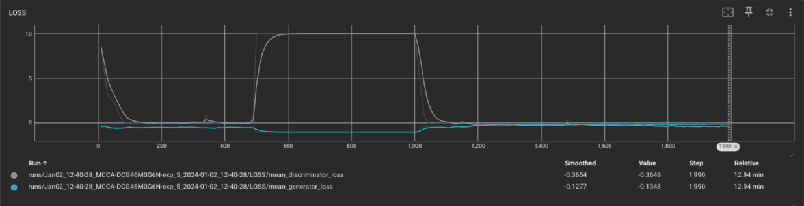
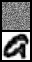
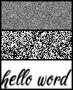
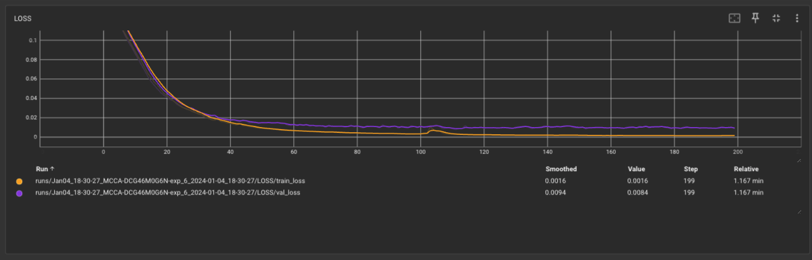

# Introduction
Improve handwriting using GANS

## Roadmap

Goal: an application that takes a scanned document written in poor handwriting and improves it towards a pretty handwriting style, with a regulator (`alpha`) that lets the user choose how much improvement is applied.

Pipeline: `scanned page -> character detection -> character classification -> per-character stylization (alpha) -> page recomposition -> Gradio app`

| Stage | Status | Branch |
| ----- | ------ | ------ |
| Pipeline skeleton (types, stages, orchestrator, CLI) | ✅ | `ft/pipeline-skeleton` |
| Spanish alphabet dataset builder (A-Z + ñ, TTF + real samples) | ✅ | `ft/alphabet-dataset` |
| Character detector (YOLOv8, MSER fallback) | ✅ | `ft/char-detector` |
| Character classifier (CNN) | ✅ | `ft/char-classifier` |
| Per-character style transfer (pix2pix) | ✅ | `ft/style-stylizer` |
| Latent-space blend regulator | ✅ | `ft/blend-regulator` |
| Per-character style transfer (pix2pix / latent AE) | ⬜ | `ft/style-stylizer` |
| Blend regulator (latent interpolation alpha) | ⬜ | `ft/blend-regulator` |
| Document recomposer (baseline alignment) | ⬜ | `ft/document-recomposer` |
| Gradio app (upload, slider, before/after) | ✅ | `ft/web-ui` |

Run the pipeline today (MSER detection + baseline cleanup stylizer):

```
python improve_document.py --input documents/page.jpeg --output documents/improved.png --alpha 0.8
```

Build the alphabet dataset (drop your pretty style `.ttf` fonts into `fonts/` first):

```
python build_alphabet.py --fonts "fonts/**/*.ttf" --out dataset/alphabet --size 64
```

Ingest your own handwriting crops later with `--samples samples/`, where `samples/` contains one directory per character class.

### Character detection with YOLOv8

The detector locates characters on a scanned page (single class: `character`);
labeling each one is the classifier's job (next milestone). Training data is
generated synthetically from the alphabet glyphs, so no manual annotation is
needed.

1. Build the alphabet glyphs (previous step, `dataset/alphabet`).

2. Generate synthetic training pages (scan-like degradation included):
   ```
   python generate_detector_dataset.py --glyphs dataset/alphabet --out dataset/detector --train-pages 500 --val-pages 100
   ```

3. Train the detector. Reference run on CPU: 5 epochs over 80 pages took ~1 min
   and already reached `mAP50 = 0.78`, `recall = 0.96`; expect near-perfect
   boxes with the settings below (~30-60 min on a modern laptop CPU):
   ```
   python train_detector.py --data dataset/detector/data.yaml --epochs 100 --imgsz 480 --out models/character_detector.pt
   ```
   Best weights are copied to `models/character_detector.pt`. Training curves
   land in `runs/detect/` (open with `tensorboard --logdir runs`).

4. Run the pipeline with the trained detector (`--detector mser` is the
   default fallback when no model is trained yet):
   ```
   python improve_document.py --input documents/page.jpeg --output documents/improved.png \
       --alpha 0.8 --detector yolo --model models/character_detector.pt --confidence 0.25
   ```

### Character classification (A-Z + Ñ)

A small CNN (`CharCNN`, ~300k parameters) labels every detected character
crop using the alphabet dataset from `build_alphabet.py`. It reads the same
normalized images, so fonts and your real handwriting samples are both used
automatically.

1. Train on the alphabet dataset (seconds on CPU; reference: 83% accuracy
   over 27 classes with only 2 fonts — add more fonts and real samples in
   `--samples` to improve it):
   ```
   python train_classifier.py --data dataset/alphabet --out models/char_classifier.pt --epochs 40
   ```

2. Pass the checkpoint to the pipeline to label characters:
   ```
   python improve_document.py --input documents/page.jpeg --output documents/improved.png \
       --alpha 0.8 --detector yolo --classifier models/char_classifier.pt
   ```

### Style transfer (ugly -> pretty, pix2pix)

A conditional GAN (`UNetGenerator` + `PatchDiscriminator`, pix2pix recipe)
learns to translate your poor handwriting towards the pretty style. One
shared network handles every character: the input crop carries the letter
shape and the network only learns the style mapping.

Training pairs are synthesized automatically: each clean alphabet glyph is
degraded with handwriting-like distortions (elastic deformation, slant,
thickness changes, scan noise) to produce its "ugly" counterpart, so both
sides of every pair are pixel-aligned without manual annotation.

1. Train on the alphabet dataset (~2 min CPU for 15 epochs; L1 drops from
   0.40 to 0.03 meaning the generator reproduces the pretty style):
   ```
   python train_stylizer.py --data dataset/alphabet --out models/char_stylizer.pt --epochs 30
   ```

2. Run the pipeline with neural stylization. The regulator `--alpha` becomes
   a cross-fade between your original stroke (0) and the full pretty style
   (1):
   ```
   python improve_document.py --input documents/page.jpeg --output documents/improved.png \
       --alpha 0.7 --detector yolo --classifier models/char_classifier.pt \
       --stylizer neural --stylizer-model models/char_stylizer.pt
   ```
   With `--stylizer baseline` (default) the regulator blends against a simple
   binarized cleanup instead, useful when no model is trained yet.

### Latent blend regulator (no ghosting at mid alphas)

The pixel cross-fade above doubles the exposure at mid alphas (both strokes
show through). The latent backend fixes this: a convolutional autoencoder —
trained to reconstruct both degraded and clean glyphs — encodes your ugly
crop and the pretty reference glyph of its class, alpha interpolates between
the two encodings, and the decoder renders a coherent intermediate
handwriting. The reference glyph per character is looked up in the alphabet
dataset using the classifier label.

1. Train the autoencoder (~30 s CPU for 20 epochs; reconstruction L1 drops
   from 0.37 to 0.04):
   ```
   python train_autoencoder.py --data dataset/alphabet --out models/char_autoencoder.pt --epochs 30
   ```

2. Run the pipeline with latent stylization. This backend requires the
   classifier so each character finds its reference glyph:
   ```
   python improve_document.py --input documents/page.jpeg --output documents/improved.png \
       --alpha 0.5 --detector yolo --classifier models/char_classifier.pt \
       --stylizer latent --ae-model models/char_autoencoder.pt --alphabet-dir dataset/alphabet
   ```

### Web UI (Gradio)

The same pipeline behind `improve_document.py` is available as a local web
app. Upload a scanned page and the app detects and labels every character
once; the improvement slider then re-stylizes the page instantly, comparing
the original document (before) against the improved one (after).

```
python web_ui.py
```

Then open http://127.0.0.1:7861. The "Backends" panel mirrors the CLI flags:
detector (`mser`/`yolo` with weights path and confidence), optional classifier
checkpoint, and stylizer (`baseline`, `neural` or `latent` with its model
paths and the alphabet dataset). The latent backend still requires a
classifier so each character finds its reference glyph.

## Experiments

### Experiment 1

My first experiment consists on improving my "a" handwriting. The first step is to teach generator to create my "a" and then improving it with a better style. In the following gif we can see how the generator learns (upper graph) based on "a" reference used by discriminator (lower graph). A metaphor for how AI and humans can go hand in hand.

### Experiment 2

Second experiment consists on a Deep Convolutional GAN (DCGAN). Main features:

• Replace any pooling layers with strided convolutions (discriminator) and fractional-strided
convolutions (generator).<br>
• Use BatchNorm in both the generator and the discriminator.<br>
• Remove fully connected hidden layers for deeper architectures.<br>
• Use ReLU activation in generator for all layers except for the output, which uses Tanh.<br>
• Use LeakyReLU activation in the discriminator for all layers.<br>

DCGAN uses convolutions which do not depend on the number of pixels on an image. However, the number of channels is important to determine the size of the filters.

We can see a checkerboard when the image passes from poor handwriting to the pretty style one. We could not initialize the discriminator to avoid this.

### Experiment 3

Same GANS model without creating a new Discriminator instance when we change the style. We continue to see a very abrupt jump.

### Experiment 4

We go back to GANS of experiment 1. However, in this case, we have a vanishing gradient issue. When we change the image, The discriminator is unable to distinguish that change and is fooled by the generator. To avoid this, we can apply Wasserstein GAN with Gradient Penalty.


### Experiment 5

Build a Wasserstein GAN with Gradient Penalty (WGAN-GP) (https://arxiv.org/abs/1701.07875, https://arxiv.org/pdf/1704.00028.pdf, https://lilianweng.github.io/posts/2017-08-20-gan/) that solves the vanishing gradient issue with the GANs seen in experiment 4.



We can see as the discriminator is able to reduce the losses when picture is changing, providing feedback to generator to adapt the new style. However, we continue to see a lot of noise which could be removed adding to the generator a denoising autoencoder module https://plainenglish.io/blog/denoising-autoencoder-in-pytorch-on-mnist-dataset-a76b8824e57e. We need to analyze why in step 490 the loss discriminator increase and then is constant.

| Experiment | Description | Results |
| -------- | -------- | -------- |
|  1   | GANS with two discriminators |    |
|  2   | GANS with convolution and two discriminators |   |
|  3   | GANS with convolution and one discriminator |   |
|  4   | GANS with one discriminator |   |
|  5   | GANS with WGAN-GP |   |


### Experiment 6

Include Autoencoder Denosing.




We can observe a high noise removal performance within a few epochs of training. However, the letters 'c' and 'e' are very similar. This might be due to the limited variability of the sample, as only one sample per character is available.

### Experiment 7

We research about object detection. We discover an important part before detection: region proposals. **Region proposal** is a technique that helps in identifying islands of regions where the pixels are similar to one another. *SelectSearch* is a region proposal algorithm used for object localization where it generates proposals of regions that are likely to be grouped together based on their pixel intensitites. However, our case is simpler and we can apply the following technique:

https://stackoverflow.com/questions/40443988/python-opencv-ocr-image-segmentation


We can see a high level character recognition but we still seeing areas with multiple characters. Therefore, Object Detection with RNN is needed.

## Project Structure

The main project folder contains the following files and folders:

```bash
pycache__
├── call_ai_grapher
│   ├── __pycache__
│   └── notebook
├── config
├── denoise
│   └── experiment_6
├── documents
│   └── experiment_7
├── fakes
│   ├── experiment_1
│   ├── experiment_2
│   ├── experiment_3
│   ├── experiment_4
│   └── experiment_5
├── fonts
│   ├── ariana-violeta-font
│   ├── believe-it-font
│   ├── glorious-free-font
│   └── winter-song-font
├── fonts_samples
│   ├── scrivener_words_ArianaVioleta-dz2K
│   │   └── images
│   ├── scrivener_words_BelieveIt-DvLE
│   │   └── images
│   └── scrivener_words_GloriousFree-dBR6
│       └── images
├── gif
├── handwriting
│   └── images
├── myhandw
│   └── images
└── runs
    ├── Jan02_10-51-48_MCCA-DCG46M0G6N-exp_4_2024-01-02_10-51-48
    ├── Jan02_11-00-46_MCCA-DCG46M0G6N-exp_4_2024-01-02_11-00-46
    ├── Jan02_11-02-49_MCCA-DCG46M0G6N-exp_4_2024-01-02_11-02-49
    ├── Jan02_11-10-56_MCCA-DCG46M0G6N-exp_4_2024-01-02_11-10-56
    ├── Jan02_11-12-18_MCCA-DCG46M0G6N-exp_4_2024-01-02_11-12-18
    ├── Jan02_11-19-26_MCCA-DCG46M0G6N-exp_4_2024-01-02_11-19-26
    ├── Jan02_11-19-45_MCCA-DCG46M0G6N-exp_4_2024-01-02_11-19-45
    │   └── LOSS
    │       ├── mean_discriminator_loss
    │       └── mean_generator_loss
    ├── Jan02_11-21-34_MCCA-DCG46M0G6N-exp_4_2024-01-02_11-21-34
    │   └── LOSS
    │       ├── mean_discriminator_loss
    │       └── mean_generator_loss
    ├── Jan02_12-39-09_MCCA-DCG46M0G6N-exp_5_2024-01-02_12-39-09
    ├── Jan02_12-40-28_MCCA-DCG46M0G6N-exp_5_2024-01-02_12-40-28
    │   └── LOSS
    │       ├── mean_discriminator_loss
    │       └── mean_generator_loss
    ├── Jan04_18-30-27_MCCA-DCG46M0G6N-exp_6_2024-01-04_18-30-27
    │   └── LOSS
    │       ├── train_loss
    │       └── val_loss
    ├── Jan05_16-45-38_MCCA-DCG46M0G6N-exp_5_2024-01-05_16-45-38
    │   └── LOSS
    │       ├── mean_discriminator_loss
    │       └── mean_generator_loss
    ├── Jan05_16-57-47_MCCA-DCG46M0G6N-exp_5_2024-01-05_16-57-47
    │   └── LOSS
    │       ├── mean_discriminator_loss
    │       └── mean_generator_loss
    └── Jan05_17-02-25_MCCA-DCG46M0G6N-exp_5_2024-01-05_17-02-25
```
## Installation process

Install [uv](https://docs.astral.sh/uv/getting-started/installation/).

Install all the dependencies. Also creates the virtual environment (`.venv`) if it didn't exist yet.
```
uv sync
```

_If the installation fails you are probably missing the required Python version. uv installs it automatically, but you can also find the required version by running `pyenv version`, and then install it by running `pyenv install x.y.z`, where x.y.z should be replaced with the version number. Depending on your internet connection and your machine the installation can take a few minutes._

Install the pre-commit hooks.
```
uv run pre-commit install
```
## Run Gans Training

```
uv run python -m train
```

## Run Autoencoder Denoising

```
uv run python -m denoise
```

## Run Jupyter (FYI)

```
uv run jupyter notebook
```
## Software dependencies
- Install [uv](https://docs.astral.sh/uv/getting-started/installation/).
## Resources
- [uv - Basic usage](https://docs.astral.sh/uv/guides/projects/)
- [pyenv - Usage](https://github.com/pyenv/pyenv#usage)

# Build and Test

Please activate the virtual environment by using `source .venv/bin/activate` before running the commands below, or prefix all commands with `uv run`.

- Run pre-commit hooks for all files (not only staged files) manually.
  ```
  pre-commit run --all-files
  ```
- Run all unit tests.
  ```
  pytest
  ```
- Measure code coverage.
  ```
  coverage run -m pytest
  ```
- Visualize code coverage.

  - View code coverage summary in terminal.
    ```
    coverage report
    ```
  - Generate HTML code coverage report.
    ```
    coverage html
    ```
  - View code coverage directly inside your code.
    ```
    coverage xml
    ```
    _Install the Coverage Gutters extension if you are using Visual Studio Code, and click on "Watch" on the left side of the status bar in the bottom of the IDE to visualize the code coverage._

# Contribute

Read [here](./CONTRIBUTING.md) how you can contribute to make our code better.


https://github.com/clovaai/CRAFT-pytorch?tab=readme-ov-file