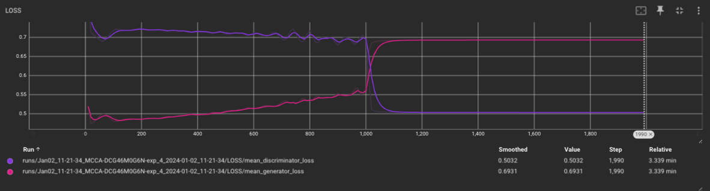
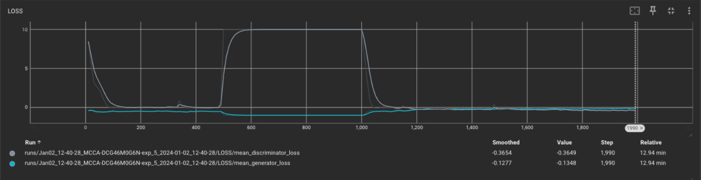
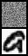
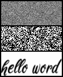
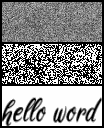
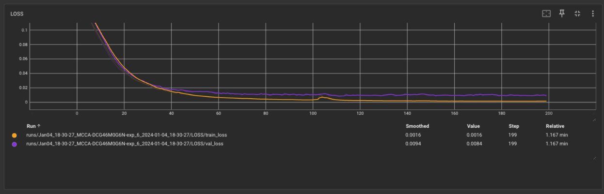
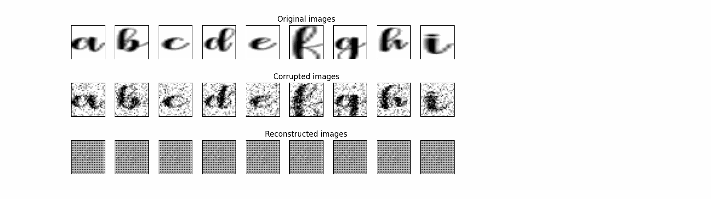
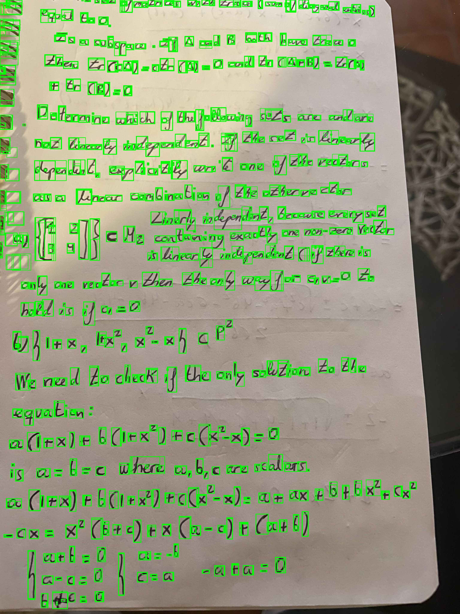

# Experiments

## :material-test-tube: **Experiment 1**

My first experiment consists on improving my "a" handwriting. The first
step is to teach generator to create my "a" and then improving it with a
better style. In the following gif we can see how the generator learns
(upper graph) based on "a" reference used by discriminator (lower
graph). A metaphor for how AI and humans can go hand in hand.

<!-- termynal -->

```
> poetry run python -m train
```

!!! Branch

    [Experiment 1](https://github.com/AlbertoVilla87/call-ai-grapher/tree/ft/prototype)

## :material-test-tube: **Experiment 2**

Second experiment consists on a Deep Convolutional GAN (DCGAN). Main features:

• Replace any pooling layers with strided convolutions (discriminator) and fractional-strided
convolutions (generator).<br>
• Use BatchNorm in both the generator and the discriminator.<br>
• Remove fully connected hidden layers for deeper architectures.<br>
• Use ReLU activation in generator for all layers except for the output, which uses Tanh.<br>
• Use LeakyReLU activation in the discriminator for all layers.<br>

DCGAN uses convolutions which do not depend on the number of pixels on an image. However, the number of channels is important to determine the size of the filters.

We can see a checkerboard when the image passes from poor handwriting to
the pretty style one. We could not initialize the discriminator to avoid
this.

<!-- termynal -->

```
> poetry run python -m train
```

!!! Branch

    [Experiment 2](https://github.com/AlbertoVilla87/call-ai-grapher/tree/ft/experiment2)

## :material-test-tube: **Experiment 3**

Same GANS model without creating a new Discriminator instance when we
change the style. We continue to see a very abrupt jump.

<!-- termynal -->

```
> poetry run python -m train
```

!!! Branch

    [Experiment 3](https://github.com/AlbertoVilla87/call-ai-grapher/tree/ft/experiment3)   

## :material-test-tube: **Experiment 4**

We go back to GANS of experiment 1. However, in this case, we have a
vanishing gradient issue.

<!-- termynal -->

```
> poetry run python -m train
```

!!! Branch

    [Experiment 4](https://github.com/AlbertoVilla87/call-ai-grapher/tree/ft/experiment_4)   



When we change the image, The discriminator is
unable to distinguish that change and is fooled by the generator. To
avoid this, we can apply Wasserstein GAN with Gradient Penalty.

## :material-test-tube: **Experiment 5**

Build a Wasserstein GAN with Gradient Penalty (WGAN-GP) (https://arxiv.org/abs/1701.07875, https://arxiv.org/pdf/1704.00028.pdf, https://lilianweng.github.io/posts/2017-08-20-gan/) that solves the vanishing gradient issue with the GANs seen in experiment 4.

<!-- termynal -->

```
> poetry run python -m train
```

!!! Branch

    [Experiment 5](https://github.com/AlbertoVilla87/call-ai-grapher/tree/ft/experiment_5)   



We can see as the discriminator is able to reduce the losses when
picture is changing, providing feedback to generator to adapt the new
style. However, we continue to see a lot of noise which could be removed
adding to the generator a denoising autoencoder module
https://plainenglish.io/blog/denoising-autoencoder-in-pytorch-on-mnist-dataset-a76b8824e57e.
We need to analyze why in step 490 the loss discriminator increase and
then is constant.

## :material-test-tube: **Summary**

| Experiment | Description | Results |
| -------- | -------- | -------- |
|  1   | GANS with two discriminators |    |
|  2   | GANS with convolution and two discriminators |   |
|  3   | GANS with convolution and one discriminator |   |
|  4   | GANS with one discriminator |   |
|  5   | GANS with WGAN-GP |   |

## :material-test-tube: **Experiment 6**

Include Autoencoder Denosing.

<!-- termynal -->

```
> poetry run python -m denoise
```

!!! Branch

    [Experiment 6](https://github.com/AlbertoVilla87/call-ai-grapher/tree/ft/experiment_6)   





We can observe a high noise removal performance within a few epochs of training. However, the letters 'c' and 'e' are very similar. This might be due to the limited variability of the sample, as only one sample per character is available.

## :material-test-tube: **Experiment 7**

We research about object detection. We discover an important part before
detection: region proposals. **Region proposal** is a technique that
helps in identifying islands of regions where the pixels are similar to
one another. *SelectSearch* is a region proposal algorithm used for
object localization where it generates proposals of regions that are
likely to be grouped together based on their pixel intensities. However,
our case is simpler and we can apply the following technique:

[OCR-Segmentation](https://stackoverflow.com/questions/40443988/python-opencv-ocr-image-segmentation)

<!-- termynal -->

```
> poetry run python -m detect_alphabet
```

!!! Branch

    [Experiment 7](https://github.com/AlbertoVilla87/call-ai-grapher/tree/ft/experiment_7)   



We can see a high level character recognition but we still seeing areas
with multiple characters. Therefore, Object Detection with RNN is
needed.
